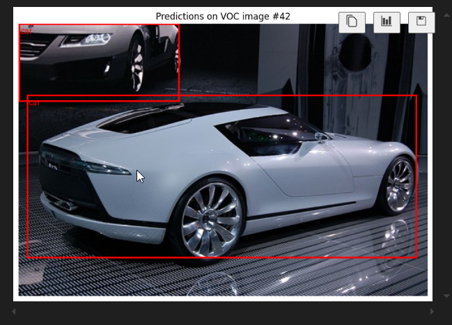

# 🧠 Object Detection with Faster R-CNN and PyTorch


An object detection pipeline built using **Faster R-CNN** with a **ResNet-50** backbone, trained on the **Pascal VOC 2007** dataset. The project supports training, evaluation, and real-time inference on both images and videos.

---

## 🚀 Features

- Custom Pascal VOC dataset loader
- Backbone layer freezing/unfreezing
- Training with mAP, Precision, Recall, and custom Accuracy metrics
- Image and video inference with bounding box visualizations
- Modular structure for easy extension

---

## 📸 Demo

<div align="center">
  
</div>

▶️ [Click here to watch the demo video](output.mp4)

---

## 🧰 Requirements

- Python 3.8+
- PyTorch & torchvision
- torchmetrics
- tqdm
- OpenCV
- matplotlib
- Pillow

Install dependencies:

```bash
pip install torch torchvision torchmetrics tqdm opencv-python matplotlib pillow
```
## Training

Train the model on Pascal VOC:
```bash
pascal.ipynb
```
- Freezes layer1 and layer2 of ResNet-50
- Fine-tunes layer3 and layer4
- Saves model weights as fasterrcnn_resnet50_voc.pth

## Evaluation

Example output after training:
```bash

--- Evaluation Metrics ---
mAP (IoU=0.5:0.95): 0.3395
Precision: 0.3207
Recall: 0.9463
Accuracy: 2.9207

```
- Accuracy here is a custom interpretation and not a standard object detection metric.

## 📄 License

This project is licensed under the MIT License. See the [LICENSE](LICENSE.txt) file for details.

